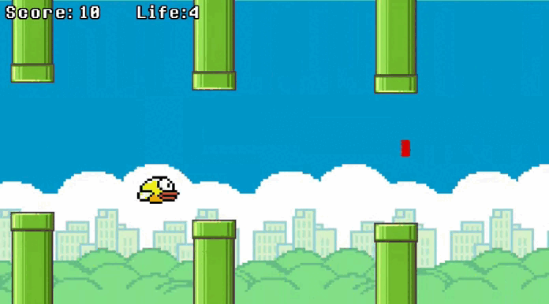

# Flappy Bird Mejoras

## Descripción del Proyecto

Flappy Bird Mejoras es una versión mejorada del clásico juego Flappy Bird. Incluye tuberías móviles y un sistema de vidas para agregar un desafío adicional.

## Características

- **Tuberías Móviles:** Después de un tiempo juegando las tuberías se moveran de arriba a abajo por unos segundos.

  
- **Vidas:** Se han añadido vidas al juego. Los jugadores podrán ir capturando vidas a lo largo del juego. Por cada colisión se pierde una vida.

- **Puntuación Mejorada:** +2 puntos, la puntuación se refleja por tuberías evitadas.

## Instrucciones de Juego

1. Presiona la barra espaciadora o toca la pantalla para que el pájaro empiece a volar.
2. Navega a través de las tuberías evitando colisionar con ellas.
3. Si el pájaro sale de la pantalla muere.
4. Supera la mayor cantidad de tuberías posible para obtener la puntuación más alta.

## Requisitos

- Móvil con android.

## Instalación

1. Clona el repositorio: Ejecuta Run.

   
